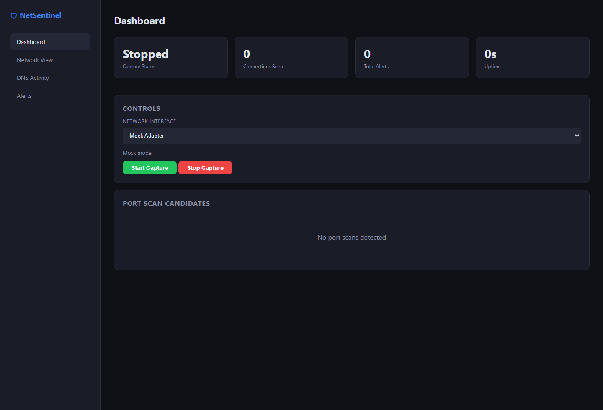

<p align="center">
  
</p>

<p align="center">
  <a href="https://www.rust-lang.org/">
    
  </a>
  <a href="https://tauri.app/">
    
  </a>
  <a href="https://tokio.rs/">
    
  </a>
  
  
</p>

# NetSentinel

NetSentinel is a Rust-based network security monitoring project with a desktop interface built on Tauri. The repository combines packet capture, threat analysis, DNS monitoring, storage, and an early desktop dashboard into a single workspace.

## Desktop Preview

<p align="center">
  
</p>

## Overview

NetSentinel is designed to explore the building blocks of a lightweight endpoint and network visibility tool. The current codebase includes:

- A Rust workspace organized into focused crates
- A Tauri desktop application with dashboard, network, and alerts views
- A CLI application for direct packet capture workflows
- Threat-detection primitives such as alerting and port-scan candidate tracking
- Supporting modules for DNS security, storage, pipeline orchestration, and AI experimentation

## Current Status

This project is in active development. The desktop shell is wired up and builds locally, and the CLI path is available for capture-oriented workflows. Several backend responses in the desktop app are still placeholders, so the repository should be treated as an evolving foundation rather than a finished security product.

## Workspace Layout

```text
netsentinel/
|-- apps/
|   |-- cli/
|   `-- desktop/
|       |-- frontend/
|       `-- src-tauri/
|-- crates/
|   |-- ai-engine/
|   |-- dns-security/
|   |-- packet-engine/
|   |-- pipeline/
|   |-- plugins/
|   |-- process-monitor/
|   |-- storage/
|   `-- threat-engine/
|-- docs/
|-- Cargo.toml
`-- Cargo.lock
```

## Architecture

At a high level, NetSentinel follows this flow:

```text
Network Interface
    -> Packet Capture Engine
    -> Event Parsing and Modeling
    -> Pipeline and Analysis Layers
    -> Threat Detection / DNS Security / Process Monitoring
    -> Storage and Desktop Presentation
```

## Technology Stack

- Rust workspace with Cargo
- Tauri 2 for the desktop application
- Tokio for async execution
- `pcap`, `pnet`, and `etherparse` for packet capture and parsing
- `sqlx` and `rusqlite` for storage
- `linfa`, `smartcore`, and `candle-core` for AI and anomaly-detection experiments

## Getting Started

### Prerequisites

- Rust toolchain with `cargo` and `rustc`
- Windows for the current desktop-first workflow
- Npcap installed if you want to use live packet capture on Windows

### Build the Desktop App

From the repository root:

```powershell
cd D:\Rust-Project\NetSen\netsentinel
cargo check -p netsentinel-desktop
cargo build -p netsentinel-desktop --release
.\target\release\netsentinel-desktop.exe
```

### Run the Desktop App in Development

```powershell
cd D:\Rust-Project\NetSen\netsentinel
cargo run -p netsentinel-desktop
```

Optional helper scripts are included:

```powershell
.\run-desktop.ps1
.\build-desktop.ps1
```

If PowerShell blocks local scripts, either use the direct `cargo` commands above or temporarily allow script execution for the current shell session:

```powershell
Set-ExecutionPolicy -Scope Process -ExecutionPolicy Bypass
```

### Run the CLI App

```powershell
cd D:\Rust-Project\NetSen\netsentinel
cargo run -p netsentinel-cli
```

## Desktop App Capabilities

The current Tauri app includes:

- A dashboard view with capture status, alerts count, and controls
- A network view for connection-oriented data
- An alerts view for threat and detection output
- Tauri commands for status, alerts, capture start, and capture stop flows

Some command endpoints currently return empty datasets while the backend integration is still being completed.

## Roadmap

Planned and in-progress areas include:

- Richer live connection data in the desktop UI
- Deeper process-to-network correlation
- DNS reputation and history workflows
- Persistent storage for events and alerts
- Expanded threat rules and anomaly detection
- Improved packaging and cross-platform polish

## Development Notes

- The workspace uses multiple crates to keep packet processing, storage, detection, and UI responsibilities separated.
- The desktop app currently uses a static frontend bundled with Tauri.
- Generated Tauri schema files under `apps/desktop/src-tauri/gen/` are intentionally ignored.

## Contributing

Contributions, refactors, and design improvements are welcome. If you plan to extend the system, keeping new work aligned with the crate boundaries in the workspace will make the codebase easier to maintain.

## License

This project is dual-licensed under either of the following, at your option:

- [MIT License](LICENSE-MIT)
- [Apache License 2.0](LICENSE-APACHE)
